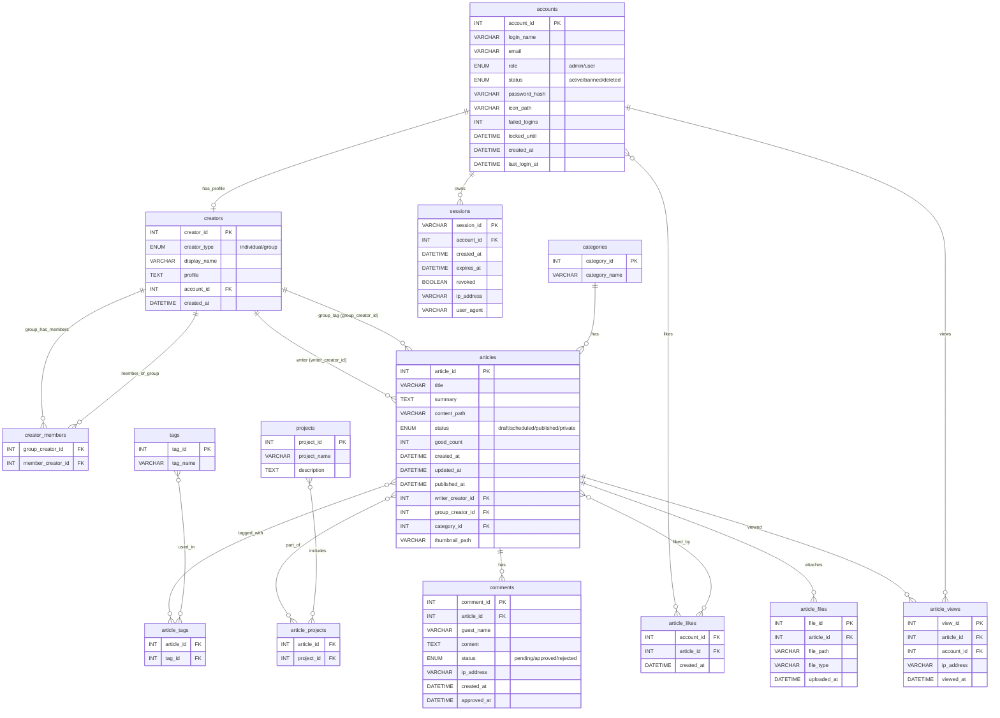

## 5. データベース設計

### 5.1. テーブル一覧（主要カラムのみ）

※型は概念レベルで記載し、具体的な長さや制約は詳細設計で確定。

### (1) accounts：アカウント（ログイン主体）
※1 つのアカウントに対し、必ず 1 つの個人クリエイター（creators）が作成される運用とする。

- account_id : PK
- login_name : ログイン用 ID（ユニーク）
- email : メールアドレス（ユニーク）
- role : `admin` / `user`
- status : `active` / `banned` / `deleted`
- password_hash : パスワードハッシュ
- icon_path : アイコン画像パス（任意）
- failed_logins : 連続ログイン失敗回数
- locked_until : ロック解除予定時刻（一定時間ロックアウト用）
- created_at : 作成日時
- last_login_at : 最終ログイン日時

### (2) creators：クリエイター（個人・グループ）
※`creator_type = 'individual'` の場合、`account_id` と 1:1 で紐付く。

- creator_id : PK
- creator_type : `individual` / `group`
- display_name : 表示名（ペンネームやグループ名）
- profile : 自己紹介・活動内容など
- account_id : 個人クリエイターに紐付くアカウント ID（グループの場合は NULL）
- created_at : 作成日時

### (3) creator_members：グループ所属関係

- group_creator_id : FK → creators（`creator_type = 'group'`）
- member_creator_id : FK → creators（`creator_type = 'individual'`）

### (4) categories：カテゴリ

- category_id : PK
- category_name : カテゴリ名（例：ゲーム開発、ロボット、インフラ等）

### (5) tags：タグ

- tag_id : PK
- tag_name : タグ名（例：Unity, React, ROS, AWS など）

### (6) projects：プロジェクト

- project_id : PK
- project_name : プロジェクト名
- description : 説明文

### (7) articles：記事（メタ情報）

- article_id : PK
- title : 記事タイトル
- summary : 要約（一覧表示やメタディスクリプションに利用）
- content_path : Markdown 本文が保存されたファイルパス
- status : `draft` / `scheduled` / `published` / `private`
- good_count : いいね総数
- created_at : 作成日時
- updated_at : 更新日時
- published_at : 公開日時（予約投稿にも使用）
- writer_creator_id : FK → creators（個人、記事のライター）
- group_creator_id : FK → creators（任意：グループタグ）
- category_id : FK → categories
- thumbnail_path : サムネイル画像パス（任意）

### (8) article_tags：記事–タグ（多対多）

- article_id : FK → articles
- tag_id : FK → tags

### (9) article_projects：記事–プロジェクト（多対多）

- article_id : FK → articles
- project_id : FK → projects

### (10) comments：コメント

- comment_id : PK
- article_id : FK → articles
- guest_name : 投稿者名（任意）
- content : コメント本文
- status : `pending` (承認待ち) / `approved` (承認済み) / `rejected` (拒否)
- ip_address : 投稿元 IP アドレス
- created_at : 作成日時
- approved_at : 承認日時（任意）

### (11) article_likes：いいね履歴

- account_id : FK → accounts
- article_id : FK → articles
- created_at : いいねした日時

※記事側の `good_count` と整合性を保つため、いいね時のトリガなどで同期。

### (12) article_files：記事添付ファイル

- file_id : PK
- article_id : FK → articles
- file_path : ファイルパス
- file_type : 種別（画像 / PDF / その他）
- uploaded_at : アップロード日時

### (13) article_views：閲覧ログ / PV

- view_id : PK
- article_id : FK → articles
- account_id : FK → accounts（匿名の場合は NULL）
- ip_address : 閲覧元 IP
- viewed_at : 閲覧日時

### (14) sessions：セッション（運営ログイン）

- session_id : PK（ランダム文字列）
- account_id : FK → accounts
- created_at : 作成日時
- expires_at : 期限
- revoked : 無効フラグ
- ip_address : ログイン時の IP
- user_agent : ブラウザ情報

---

## 5.2. ER 図（完成版）

