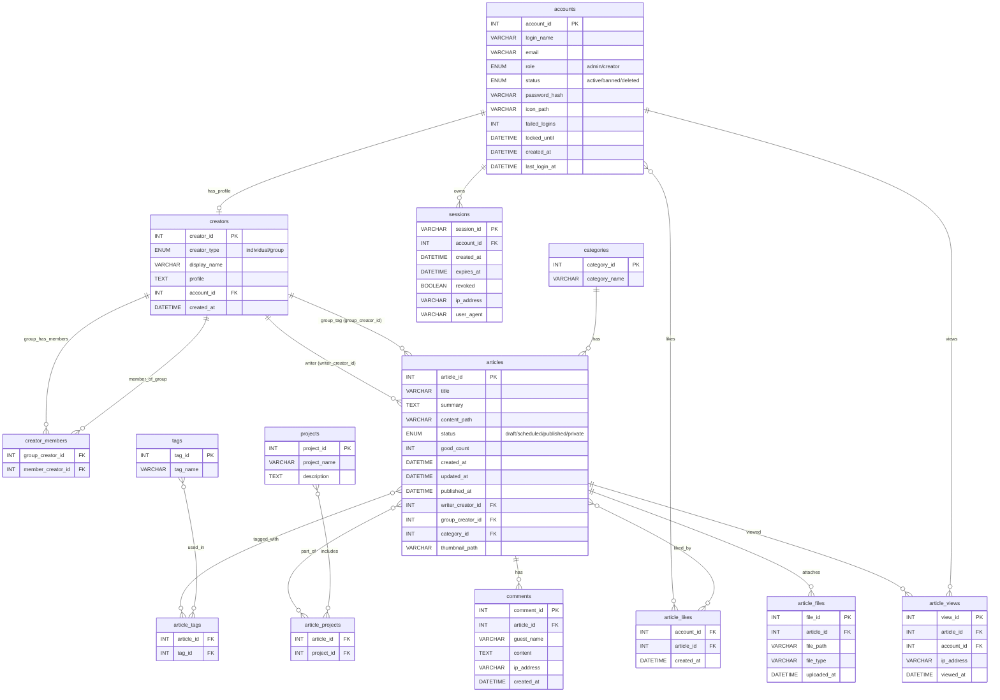

# 📝 技術系サークルブログ 設計文書（完成版）

## 1. 概要

本ブログシステムは、岡山県立大学 × OPUCoder の技術系サークル活動を発信・記録するための **活動ブログ** である。

目的：

- サークルメンバーの技術的な **活動記録・振り返り**
- 実装ノウハウ・失敗談を含む **知識共有**
- 対外的な **技術力・活動実績のアピール**

特徴：

- 記事本文は **Markdown** 形式（コードハイライト対応）
- 記事本文は DB に直接保存せず、**ファイルパス（content_path）で管理するハイブリッド構成**
- 一般ユーザーはログイン不要でコメント可能（名前は任意）
- 「いいね」は記事側にカウントを持ちつつ、アカウント別履歴も保存
- プロジェクト／グループごとに記事を紐付けて閲覧・管理が可能
- 運営側は **ログインシステム** により Admin / Creator の権限を分離

---

## 2. 主要機能要件

### 2.1. 記事作成・管理機能

| No. | 機能名 | 内容 |
| --- | --- | --- |
| F-01 | 本文記述 | 記事本文を Markdown 形式で記述。コードブロックはシンタックスハイライト対応。
本文はストレージ上の外部ファイルに保存し、DB には `content_path` を保持する。 |
| F-02 | プレビュー | 編集画面でリアルタイムまたは切り替え式プレビューを提供。
Markdown → HTML 変換結果を表示。 |
| F-03 | 投稿予約 | 公開日時（published_at）を設定し、指定日時に自動で公開状態へ遷移させる。
バックエンドは Cron / EventBridge / バッチ等で実現。 |
| F-04 | メディア挿入 | 画像などのメディアをアップロードし、Markdown 内から参照できる。
DB では `article_files` および（必要に応じて）メディアテーブルで管理。 |
| F-05 | 分類設定 | 記事ごとにカテゴリ（1つ）、タグ（複数）、プロジェクト（複数）、グループ（任意）を設定可能。 |
| F-06 | ステータス管理 | 記事ステータスを「ドラフト (draft)」「予約 (scheduled)」「公開 (published)」「非公開 (private)」で管理。
ステータス遷移は権限により制御。 |
| F-07 | いいね | 記事のいいね数を `good_count` として記事側に保持。履歴は `article_likes` にアカウント単位で保存。 |

### 2.2. 記事表示・閲覧機能

| No. | 機能名 | 内容 |
| --- | --- | --- |
| F-08 | 記事一覧 | トップページで記事一覧を表示。標準は新着順（published_at 降順）。
オプションで更新日順、人気順（good_count や PV）で並び替え。 |
| F-09 | フィルタリング | カテゴリ、タグ、プロジェクト、グループ（チーム）ごとの絞り込み表示。 |
| F-10 | 検索機能 | タイトル・タグ・ライター（個人名・グループ名）・サマリーからキーワード検索が可能。
投稿日（yyyy/MM/dd）での絞り込みも行う。 |
| F-11 | 目次表示 | 記事本文の見出し（H2/H3）から自動的に目次を生成し、記事詳細ページに表示。 |
| F-12 | コメント | ログイン不要で誰でもコメント投稿可能。名前は任意（未入力時は「名無し」扱いなど）。
コメントごとに IP アドレスを保存し、荒らし対策に利用。管理画面から削除可能。 |
| F-13 | 閲覧ログ / PV | 記事へのアクセスを `article_views` に記録。
ログイン済みの場合は account_id、匿名の場合は IP アドレスのみ保存。
PV 集計・人気記事ランキング等に利用。 |

### 2.3. アカウント・クリエイター・ロール管理機能

| No. | 機能名 | 内容 |
| --- | --- | --- |
| F-14 | アカウント認証 | 運営側（Admin / Creator）がログインして管理画面を利用できる。
認証はアカウントとパスワードで行う。 |
| F-15 | クリエイター管理 | クリエイター（個人 / グループ）の登録・編集・ステータス管理。
グループへのメンバー追加・削除（個人クリエイターをグループに所属させる）。 |
| F-16 | 権限制御 | `account.role` に基づき、記事作成・編集・公開、クリエイター管理等の操作可否を制御。 |
| F-17 | ライター／グループタグ | 記事には必ず「ライター（個人クリエイター）」を 1 つ紐付け、
任意で「グループ（グループクリエイター）」をタグとして紐付ける。 |

---

## 3. ドメインモデルとロール定義

### 3.1. アカウント（Account）

- ログイン可能な主体。
- ロールを持つ。
    - `role = 'admin'` : 管理者
    - `role = 'creator'` : 個人クリエイター
- アカウント単位でログインし、記事編集・管理を行う。

### 3.2. クリエイター（Creator）

- サークルの「創作者」を表現するドメイン上の概念。
- 種類：
    - `creator_type = 'individual'` : 個人クリエイター
        - 1つの `account` と紐付く（ログインできる人）。
    - `creator_type = 'group'` : グループクリエイター
        - 開発班／プロジェクトチームなどの集合体。直接ログインはしない。

### 3.3. グループメンバーシップ

- テーブル `creator_members` で表現。
- `group_creator_id`（グループ）に対して `member_creator_id`（個人）を紐づける。
- そのグループに所属する個人クリエイターが、グループ名義の記事を執筆できる。

### 3.4. ライターとグループタグ

- **ライター**:
    - 各記事には必ず 1 人の「ライター」となる個人クリエイターを紐づける。
    - DB 上は `articles.writer_creator_id` で表現。
- **グループタグ**:
    - 記事をどのグループとして発信しているかを示すタグ。
    - DB 上は `articles.group_creator_id`（任意）で表現。
- 検索 UI 上は、「ライター（個人名）」と「チーム名（グループ名）」の両方をライター検索条件として扱う。

### 3.5. Admin の役割

- Admin は「管理者ロール」であり：
    - 全ての記事の **公開・非公開・予約設定** を変更できる。
    - 全てのクリエイター（個人・グループ）の情報・ステータスを編集できる。
    - 必要に応じて、記事・コメント等の削除権限も持つ。

### 3.6. ステータス遷移ルール

- クリエイター（個人）が記事を作成した時点では必ず `status = 'draft'`。
- クリエイターは記事本文やメタ情報を編集できるが、ステータスを `scheduled` / `published` / `private` に変更する権限は持たない。
- Admin のみがステータスの変更を行える。
- 想定される遷移例：
    - `draft → scheduled → published → private`
    - `draft → published`
    - `published → private`
    - 逆方向の遷移（private → published 等）も Admin の判断で許可。

---

## 4. 技術スタック・システム構成

| 項目 | 採用技術 | 役割 |
| --- | --- | --- |
| フロントエンド | React + TypeScript | ブログ閲覧・検索・管理画面 UI。SPA または Next.js など。 |
| バックエンド | Python + FastAPI（想定） | REST API サーバ。認証・権限・ビジネスロジック・予約投稿処理トリガー。 |
| データベース | MySQL（Amazon RDS） | 記事メタ情報、クリエイター・アカウント情報、コメント、PV、いいね等。 |
| ストレージ | S3 などのオブジェクトストレージ | Markdown 本文ファイル（content_path）、画像等のメディアファイルの保存。 |
| 配信 | CloudFront 等 | 画像・静的ファイルの CDN 配信、パフォーマンス改善。 |
| 予約投稿 | Cron / Lambda + EventBridge 等 | `scheduled` 記事を `published` に自動更新する処理。 |

※実装言語・クラウドは変更可能だが、設計の前提として上記を想定。

---

## 5. データベース設計

### 5.1. テーブル一覧（主要カラムのみ）

※型は概念レベルで記載し、具体的な長さや制約は詳細設計で確定。

### (1) accounts：アカウント（ログイン主体）

- account_id : PK
- login_name : ログイン用 ID（ユニーク）
- email : メールアドレス（ユニーク）
- role : `admin` / `creator`
- status : `active` / `banned` / `deleted`
- password_hash : パスワードハッシュ
- icon_path : アイコン画像パス（任意）
- failed_logins : 連続ログイン失敗回数
- locked_until : ロック解除予定時刻（一定時間ロックアウト用）
- created_at : 作成日時
- last_login_at : 最終ログイン日時

### (2) creators：クリエイター（個人・グループ）

- creator_id : PK
- creator_type : `individual` / `group`
- display_name : 表示名（ペンネームやグループ名）
- profile : 自己紹介・活動内容など
- account_id : 個人クリエイターに紐付くアカウント ID（グループの場合は NULL）
- created_at : 作成日時

### (3) creator_members：グループ所属関係

- group_creator_id : FK → creators（`creator_type = 'group'`）
- member_creator_id : FK → creators（`creator_type = 'individual'`）

### (4) categories：カテゴリ

- category_id : PK
- category_name : カテゴリ名（例：ゲーム開発、ロボット、インフラ等）

### (5) tags：タグ

- tag_id : PK
- tag_name : タグ名（例：Unity, React, ROS, AWS など）

### (6) projects：プロジェクト

- project_id : PK
- project_name : プロジェクト名
- description : 説明文

### (7) articles：記事（メタ情報）

- article_id : PK
- title : 記事タイトル
- summary : 要約（一覧表示やメタディスクリプションに利用）
- content_path : Markdown 本文が保存されたファイルパス
- status : `draft` / `scheduled` / `published` / `private`
- good_count : いいね総数
- created_at : 作成日時
- updated_at : 更新日時
- published_at : 公開日時（予約投稿にも使用）
- writer_creator_id : FK → creators（個人、記事のライター）
- group_creator_id : FK → creators（任意：グループタグ）
- category_id : FK → categories
- thumbnail_path : サムネイル画像パス（任意）

### (8) article_tags：記事–タグ（多対多）

- article_id : FK → articles
- tag_id : FK → tags

### (9) article_projects：記事–プロジェクト（多対多）

- article_id : FK → articles
- project_id : FK → projects

### (10) comments：コメント

- comment_id : PK
- article_id : FK → articles
- guest_name : 投稿者名（任意）
- content : コメント本文
- ip_address : 投稿元 IP アドレス
- created_at : 作成日時

### (11) article_likes：いいね履歴

- account_id : FK → accounts
- article_id : FK → articles
- created_at : いいねした日時

※記事側の `good_count` と整合性を保つため、いいね時のトリガなどで同期。

### (12) article_files：記事添付ファイル

- file_id : PK
- article_id : FK → articles
- file_path : ファイルパス
- file_type : 種別（画像 / PDF / その他）
- uploaded_at : アップロード日時

### (13) article_views：閲覧ログ / PV

- view_id : PK
- article_id : FK → articles
- account_id : FK → accounts（匿名の場合は NULL）
- ip_address : 閲覧元 IP
- viewed_at : 閲覧日時

### (14) sessions：セッション（運営ログイン）

- session_id : PK（ランダム文字列）
- account_id : FK → accounts
- created_at : 作成日時
- expires_at : 期限
- revoked : 無効フラグ
- ip_address : ログイン時の IP
- user_agent : ブラウザ情報

---

## 5.2. ER 図（完成版）

---

## 6. 運営側ログイン・認可設計（仕様レベル）

### 6.1. 認証フロー

1. 管理画面のログインフォームから **ログイン名 + パスワード** を送信。
2. バックエンド側で `accounts` を参照し：
    - `status` が `active` であること
    - ロックアウトされていないこと (`locked_until` チェック)
    - パスワードハッシュが一致すること
        
        を確認。
        
3. 認証成功時：
    - `sessions` に新しいセッションレコードを作成。
    - `session_id` を HttpOnly Cookie としてクライアントに返却。
4. 以降の管理系 API では、この Cookie を元に `sessions` → `accounts` → `creators` を参照してログイン状態・権限を判定。

### 6.2. 認可（権限チェック）

- `account.role = 'admin'` の場合：
    - 全記事の閲覧・編集・削除
    - 記事の `status` を任意に変更（公開・非公開・予約）
    - クリエイター（個人・グループ）の登録・編集・BAN 等
- `account.role = 'creator'` の場合：
    - 自分の `creator` に紐づく記事（ライター or 所属グループ）の作成・編集
    - ステータスは常に `draft` として保存（変更不可）
    - いいね・自身のプロジェクト管理など（運用方針に応じて調整）

---

## 7. セキュリティ・運用上の方針（要点）

- パスワードは強ハッシュ（bcrypt / Argon2 など）を使用。
- セッションは HttpOnly・Secure・SameSite を適切に設定した Cookie で管理。
- CSRF 対策として、管理画面では CSRF トークン方式を採用。
- Markdown → HTML 変換結果はサーバ側でサニタイズし、XSS を防止。
- ログイン失敗回数に応じた一時ロックアウト、IP ベースのレート制限を導入。
- コメント・閲覧ログには IP を記録し、荒らし対策・分析に活用。
- 定期的な DB バックアップ・バージョン管理・ログ監視を実施。